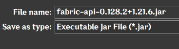
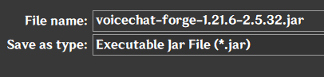
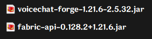
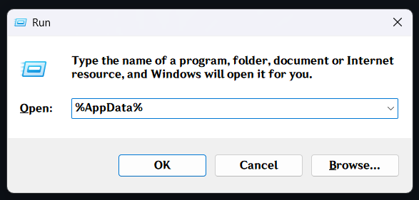
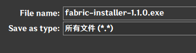
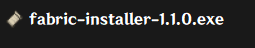
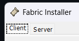
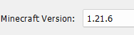
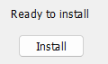
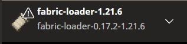

# CJY-SERVER-FABRIC-INSTALLATION-GUIDE
这个SERVER是1.21.6版本的，只能在1.21.6使用, 玩家需要安装 Fabric 和 Mod 才可以使用那些功能，适用于 Minecraft Launcher 和 Tlauncher 的玩家
### CJY SERVER IP ADDRESS:
### downloads-mechanisms.gl.joinmc.link
---
## MODPACK + API
下载 Fabric 的 API，API 也就是 Fabric Mod 和 Minecraft 连接的桥
https://cdn.modrinth.com/data/P7dR8mSH/versions/F5TVHWcE/fabric-api-0.128.2%2B1.21.6.jar

下载 Mod
例子：Simple Voice Chat

你会得到一个 Fabric API 的 java file 和 你要的 MOD java file

Win + R 输入 %AppData%

进入 .minecraft folder

进入 mods

把 MOD 和 Fabric API 的 java file paste 在 mods folder

---

## 如果还没装 Fabric 1.21.6
下载 Fabric 的安装包
https://maven.fabricmc.net/net/fabricmc/fabric-installer/1.1.0/fabric-installer-1.1.0.exe

打开这个 Fabric Installer

确保上面选择 Client

Version 选 1.21.6

剩下的不用管，直接按 Install

打开 Minecraft Launcher，你就可以看到那个 Profile 是 Fabric 1.21.6 的了，如果没有关掉重开

盗版 Tlauncher 玩家需要在 Tlauncher Menu 里选 **Release Fabric Loader 1.21.6** 就可以了

## 注意
**Tlauncher** 玩家确保选择的是 **Release Fabric Loader 1.21.6**，不是 **Fabric 1.21.6**， 不要选错！

❌❌❌❌❌❌❌❌

❌❌❌❌❌❌❌❌
